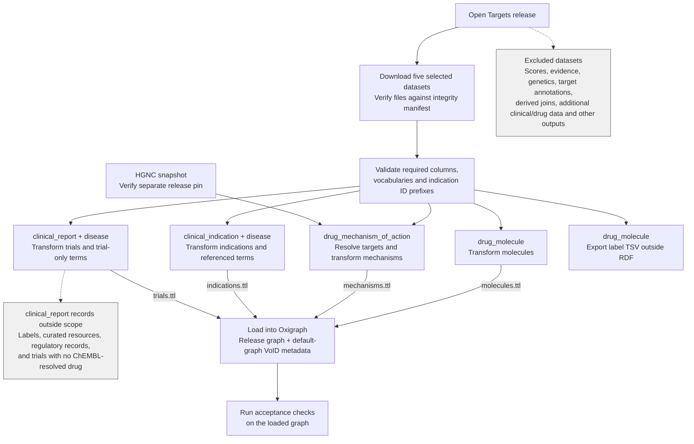

# Open Targets design decisions

This document records the drug-layer model and validation contract. See
[README.md](README.md) for operations and release statistics, [TRIALS.md](TRIALS.md) for
the trial layer's scope record, [datasets/](datasets/) for per-dataset source notes, and
[manifests/](manifests/) for recorded results.

## 1. Release contents and scope

Open Targets Platform 26.06 is a collection of related datasets. Its
`release_data_integrity` inventory lists 56 directories under `output/`, covering
targets, diseases, drugs, clinical records, genetic evidence, association scores and
supporting annotations. This ingest downloads five of those datasets as Parquet, and
projects all five; each can contain one file or several parts.

The selected inputs are listed below. Counts are **source rows in release 26.06**, from
the [source manifest](manifests/26.06-sources.tsv), not emitted edge counts. The [column
report](manifests/26.06-column-verification.md) records their layouts.

| Source dataset | Rows | What the source contains | What this ingest emits |
|---|---:|---|---|
| [`drug_molecule`](datasets/drug_molecule.md) | 22,407 | ChEMBL IDs, names, synonyms, trade names, modality, structures, parent molecule and overall clinical stage | Molecule nodes and properties; a separate label TSV |
| [`drug_mechanism_of_action`](datasets/drug_mechanism_of_action.md) | 6,500 | Lists of ChEMBL drugs and Ensembl targets, action, mechanism text and target type/name | Drug–gene associations and HGNC gene nodes; rows expand across drugs and resolved targets |
| [`clinical_indication`](datasets/clinical_indication.md) | 86,468 | Drug–disease pairs, maximum clinical stage and supporting report IDs | Indication associations with stage and report count |
| [`disease`](datasets/disease.md) | 47,080 | MONDO, EFO and other disease/phenotype IDs, names, synonyms, ontology ancestry, cross-references and therapeutic areas | Typed nodes, labels and synonyms for the 4,059 terms referenced by indications or trials; no ontology hierarchy |
| [`clinical_report`](datasets/clinical_report.md) | 289,955 | Trials, labels and regulatory records, including stage, drugs, diseases, trial dates, stop reasons and review information | Trial nodes with stage, overall status, start month, stop reasons and quality-control flags, linked to compounds and diseases; only `type = CLINICAL_TRIAL` and only where a drug resolved to ChEMBL — see [TRIALS.md](TRIALS.md) |

Open Targets uses an [EFO-based disease/phenotype
ontology](https://platform-docs.opentargets.org/disease-or-phenotype) that includes
MONDO terms. In 26.06, 70,521 of 86,468 indication rows (about 82%) reference MONDO IDs;
others use HP (HPO), EFO, Orphanet, MP and additional prefixes listed in the [prefix
audit](manifests/26.06-column-verification.md#disease-id-prefixes-used-by-clinical_indication).
The ingest preserves these source identifiers rather than normalizing all terms to
MONDO.

ChEMBL IDs connect molecules to mechanisms, indications and trials; disease IDs connect
indications and trials to term labels. Mechanism targets are Ensembl IDs, resolved
through a separately pinned HGNC snapshot so they share gene identity with the Reactome
ingest and join its gene nodes directly by IRI. The indication transform counts
`clinicalReportIds` directly and does not emit them, so an indication edge and the trial
nodes behind it are joined by a consumer on (drug, disease) rather than by an asserted
link; the count is also over all four record kinds while trial nodes are trials only.

The remaining release directories are outside the default pipeline's scope. Examples
from the pinned release inventory:

| Excluded data | Dataset examples | Scope decision |
|---|---|---|
| Target–disease scores | `association_overall_*`, `association_by_datasource_*`, `association_by_datatype_*` | Outside the initial drug-layer scope; may be added later for ranking, alongside the evidence they summarize |
| Supporting evidence and genetics | `evidence_*`, `variant`, `study`, `credible_set`, `colocalisation`, `l2g_prediction` | Separate evidence and variant models would be needed |
| Target and biological annotations | `target`, `target_essentiality`, `target_prioritisation`, `baseline_expression`, `interaction`, `reactome`, `go` | This pass emits only the gene nodes needed by mechanisms |
| Derived drug–target–disease join | `clinical_target` | Reproducible from datasets already ingested, and with a coarser clinical stage |
| Additional clinical and drug data | `drug_warning`, `pharmacogenomics`, `openfda_significant_adverse_drug_reactions` | Outside the current molecule/mechanism/indication/trial model |

`clinical_target` overlaps with data already available from clinical reports and
mechanisms. Its drug–target–disease combinations can be reconstructed by joining those
datasets on drug under the indication quality-control filter. The current projection
retains indication-level stages and includes trials without mapped diseases as drug-only
nodes.

Selecting a dataset also does not imply usage of all its fields. For example, molecule
`crossReferences` and disease ancestry/cross-references stay out of the graph.
[common.py](common.py)'s `DATASETS` defines the downloaded subset and required columns;
the transforms define which values are emitted.

### Ingest flow

Solid arrows show data flow. Dashed branches show retained or excluded data with no RDF
output. HGNC is an independent input, outside the Open Targets release.



[pipeline.py](pipeline.py) runs the transforms and label export sequentially. Transforms
read the verified source files independently; the loader combines their Turtle outputs.
Indications and trials determine their respective disease node sets from the source
columns, so neither depends on the other's output.

## 2. Sources and provenance

Discover dataset filenames from FTP: Spark part names can change each release. Verify
and record the inputs in this order:

1. Verify `release_data_integrity` against `release_data_integrity.sha1`.
2. Verify each downloaded part against that manifest.
3. Commit `manifests/<release>-sources.tsv` with upstream SHA-1, local SHA-256,
   byte counts and row counts. Record the manifest's SHA-1 as the release anchor
   in `release.json` and VoID metadata.

Every pinned part must be present and unchanged; extra, unpinned Parquet files also fail
verification because transforms read whole dataset directories. `--skip-download` still
verifies local inputs.

HGNC is pinned separately in `manifests/<release>-hgnc.json` and verified on download,
offline verification and mechanism transformation. Add a reviewed snapshot pin for each
new release; normal runs never replace it.

`croissant.json` supplies the publication date and licence. Only the top-level `result`
is read from the large build-log `manifest.json`; it is recorded but does not gate
ingestion. See the [26.06 packaging failure](README.md#upstream-build-status).

## 3. Target model

[schema/opentargets.yaml](../schema/opentargets.yaml) defines the model. Biolink
supplies classes and predicates; acceptance checks validate emitted terms against the
version pinned in `settings.biolink_version`. Undefined Biolink terms fail validation.
Undefined `sagebrain:` terms are reported for model review.

Namespace bases are defined in [shared/rdf.py](../shared/rdf.py) and
[common.py](common.py). `sagebrain:` is the local model namespace.

Mechanisms and indications are reified associations with typed endpoints and
`infores:open-targets` provenance. In this documentation, “edge” refers to an
association record. Trials are study nodes with properties and links to compounds and
conditions.

```turtle
CHEMBL:CHEMBL2103875
    a biolink:SmallMolecule ;
    rdfs:label "TRAMETINIB" ;
    sagebrain:drug_type "Small molecule" ;
    sagebrain:inchi_key "LIRYPHYGHXZJBZ-UHFFFAOYSA-N" ;
    sagebrain:overall_clinical_stage "APPROVAL" ;
    skos:altLabel "GSK1120212" , "MEKINIST" .

HGNC:6840  a biolink:Gene ; rdfs:label "MAP2K1" ; biolink:in_taxon NCBITaxon:9606 .

[] a biolink:ChemicalAffectsGeneAssociation ;
   biolink:subject CHEMBL:CHEMBL2103875 ;
   biolink:object HGNC:6840 ;
   biolink:predicate biolink:affects ;
   sagebrain:action_type "INHIBITOR" ;
   sagebrain:mechanism_of_action "Dual specificity mitogen-activated protein kinase kinase 1 inhibitor" ;
   sagebrain:target_type "single protein" ;
   biolink:original_object "ENSEMBL:ENSG00000169032" ;
   biolink:primary_knowledge_source infores:open-targets .

[] a biolink:ChemicalOrDrugOrTreatmentToDiseaseOrPhenotypicFeatureAssociation ;
   biolink:subject CHEMBL:CHEMBL1614701 ;
   biolink:object EFO:EFO_0000658 ;
   biolink:predicate biolink:treats_or_applied_or_studied_to_treat ;
   sagebrain:max_clinical_stage "APPROVAL" ;
   sagebrain:clinical_report_count 14 ;
   biolink:primary_knowledge_source infores:open-targets .

CLINICALTRIALS:NCT02407405
    a biolink:ClinicalTrial ;
    rdfs:label "Phase II Trial of the MEK1/2 Inhibitor Selumetinib ..." ;
    sagebrain:trial_clinical_stage "PHASE_2" ;
    biolink:clinical_trial_overall_status "ACTIVE_NOT_RECRUITING" ;
    sagebrain:trial_start_date "2016-01"^^xsd:gYearMonth ;
    sagebrain:trial_drug CHEMBL:CHEMBL1614701 ;
    biolink:clinical_trial_conditions EFO:EFO_0000658 .
```

## 4. Modelling rules

- **Gene identity.** Resolve Ensembl targets to HGNC so they join Reactome genes
  by IRI. Preserve the Ensembl ID as a string in `biolink:original_object`.
  Multiple HGNC matches produce multiple associations. Fail when more than 10%
  of target lookups are unresolved; the threshold counts lookups, not distinct IDs.
- **Mechanisms.** Use `biolink:affects` and preserve the source action in
  `sagebrain:action_type`. Keep `sagebrain:target_type` on every association:
  family and complex members come from a group claim, not independently measured
  interactions. Filter by target type when counting drug–target interactions.
- **Indications.** Use `biolink:treats_or_applied_or_studied_to_treat` because the
  dataset includes investigational uses. Clinical stage belongs to the specific
  drug–disease pair; its maximum does not preserve trial history or stop reasons —
  trial nodes preserve individual trial properties.
- **Trials.** Emit study nodes keyed by ClinicalTrials.gov accession for
  `CLINICAL_TRIAL` records naming a ChEMBL-resolved drug. Use Biolink properties
  where the domain, range, and vocabulary match; retain local properties for
  compound links, clinical stage, and month-precision start dates. Preserve
  status alongside stop reasons. See [TRIALS.md](TRIALS.md).
- **Molecule classes.** Map `Small molecule` to `biolink:SmallMolecule` and other
  modalities to `biolink:ChemicalEntity`. Preserve `drugType` as
  `sagebrain:drug_type`; finer classification is not validated by this ingest,
  and `ChemicalEntity` is a loose fit for cell therapies.
- **Disease and phenotype nodes.** Emit only terms referenced by an indication or
  a trial. `indications.ttl` emits indication-referenced terms; `trials.ttl` emits
  additional terms referenced only by trials. Type by ID prefix: MONDO uses
  `biolink:Disease`; HP/MP use `biolink:PhenotypicFeature`; GO/OBA use
  `biolink:DiseaseOrPhenotypicFeature`. See `DISEASE_NODE_CLASS` in `common.py`
  for the full mapping. Unknown identifier prefixes fail validation.
- **Names and parents.** Preserve synonyms and trade names as `skos:altLabel`.
  Emit `sagebrain:parent_molecule` from `parentId` so salt forms can link to
  their parent despite overlapping labels.

The three clinical-stage properties have different scopes, narrowest last:

| Source column | RDF property | Attached to |
|---|---|---|
| `drug_molecule.maximumClinicalStage` | `sagebrain:overall_clinical_stage` | Molecule |
| `clinical_indication.maxClinicalStage` | `sagebrain:max_clinical_stage` | Drug–disease association |
| `clinical_report.clinicalStage` | `sagebrain:trial_clinical_stage` | Trial |

The molecule's stage is copied from the source, not computed from this graph's
indications. It does not identify a disease and is not ChEMBL's numeric `max_phase`.
Acceptance checks validate that each property appears only on its intended subject type
and that subjects do not carry multiple clinical-stage properties.

## 5. Duplicates and label ambiguity

Mechanism rows contain lists of drugs and targets. Expand them, resolve genes, then
deduplicate by (ChEMBL ID, HGNC ID, action, mechanism text, target type, Ensembl ID).
Report collapsed duplicates; rows without gene targets are counted but produce no
association.

The label TSV has one row per (case-folded label, molecule), with `ambiguous=yes` when a
label names multiple molecules. RDF retains each molecule's own labels. The ingest never
selects a winning candidate; stronger name normalization and ambiguity resolution belong
to consumers.

## 6. Validation and failures

Before transformation, [verify_schemas.py](verify_schemas.py) validates required
columns, controlled vocabularies, and indication identifier prefixes. Additional columns
are allowed; missing required columns and unknown values fail validation. Report
vocabularies are checked across the source dataset, including records outside the trial
projection.

Integrity failures, unpinned inputs, excessive unresolved target lookups, and excessive
implausible trial dates also stop the pipeline.

[acceptance_checks.py](acceptance_checks.py) validates the loaded graph:

- Compound typing and labels, and typed endpoints for mechanism and indication
  associations. Referenced compounds absent from the molecule dataset receive
  typed stubs without inferred labels or modalities.
- Clinical stages, action types, and target types against their vocabularies.
- HGNC gene identifiers and taxon cardinality.
- Release size within `TRIPLE_RANGE` and agreement with `void:triples` within the
  configured tolerance when metadata is present.
- Known mechanism, indication, and trial facts.
- Clinical-stage properties on their intended subject types.
- Trial identifiers, links, vocabularies, start dates, statuses, and stop reasons.
- Biolink terms against the pinned release and local terms against sagebrain-model.

Structural failures and undefined Biolink terms fail validation. Undefined local terms
and unavailable vocabulary sources produce warnings. `--biolink-yaml` selects a local
Biolink schema for review or offline use; model lookup may still require network access.

Acceptance runs after loading. A failure leaves the generated Turtle and loaded graph
available for diagnosis.

## 7. Graphs and refresh

Reloading replaces `urn:sagebrain:opentargets:<release>`, retaining other releases. The
loader reads `molecules.ttl`, `mechanisms.ttl`, `indications.ttl` and `trials.ttl`; keep
reports and exports outside `rdf/`.

VoID metadata lives in the default graph: source URL, release anchor, licence, citation,
triple count and comments explaining stage scope, indication semantics, group targets,
gene identity, what the trial layer's scope filters exclude, and why trial start dates
carry month precision.

For SageBrain deposits, prepare provenance for the dated destination graph and supply a
separate `manifest.ttl`. See the [deposit instructions](README.md#deposit-to-sagebrain).

## 8. Open decisions

- **Structure-based resolution:** InChIKey and SMILES are emitted; a resolver
  using them is not implemented.
- **Cross-references:** Compound `crossReferences`, including PubChem and DrugBank,
  are outside the projection and required-column validation.
- **Indication-to-report links:** `clinicalReportIds` are counted but not emitted.
  Joining on drug and disease does not reproduce the source report list exactly.
- **Trial literature:** `trialLiterature` could support publication links from
  trial nodes. It is currently outside the projection and required-column validation.
- **Direct model predicates:** `sagebrain:targets` and `sagebrain:used_to_treat`
  require review of their Drug domain, treatment semantics, and representation
  of target groups before supplementing the reified associations.
- **Local vocabulary definitions:** Acceptance reports identify emitted
  `sagebrain:` terms awaiting definition in sagebrain-model.
